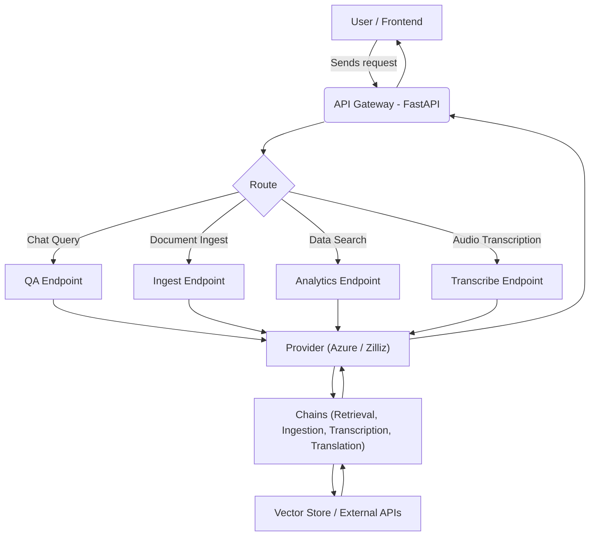
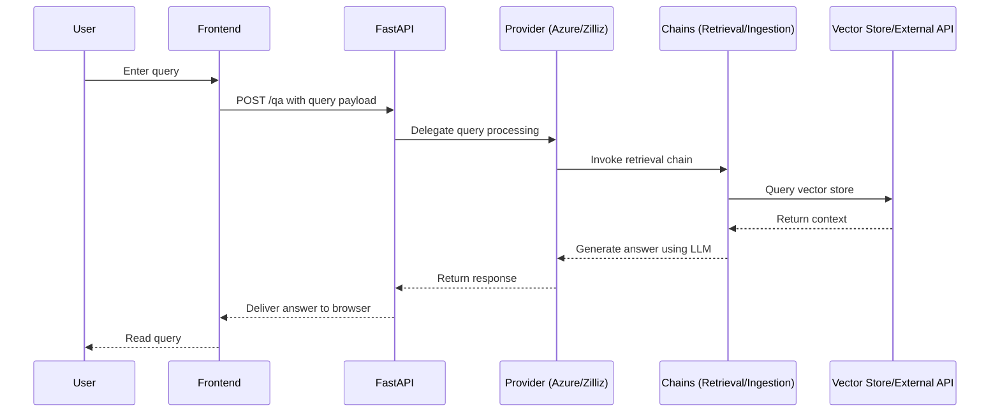

# Langchain-AI-Chatbot-Server

An advanced AI Chatbot server powered by Langchain, OpenAI, and Zilliz or Azure.  
This project provides a robust conversational pipeline for document processing, retrieval-based Q&A, document ingestion, audio transcription, and data analytics.

---

## Table of Contents

- [Langchain-AI-Chatbot-Server](#langchain-ai-chatbot-server)
  - [Table of Contents](#table-of-contents)
  - [Overview](#overview)
  - [Features](#features)
  - [Architecture](#architecture)
    - [Component Diagram](#component-diagram)
    - [Sequence Diagram](#sequence-diagram)
  - [Project Structure](#project-structure)
  - [Installation \& Setup](#installation--setup)
    - [Prerequisites](#prerequisites)
    - [Installation](#installation)
  - [Configuration](#configuration)
  - [Services Setup](#services-setup)
    - [Azure Provider](#azure-provider)
      - [Azure OpenAI (Question and Answer LLM)](#azure-openai-question-and-answer-llm)
      - [Azure AI Search (Question and Answer Search/VectorDB)](#azure-ai-search-question-and-answer-searchvectordb)
      - [Azure Cosmos DB (FAQ)](#azure-cosmos-db-faq)
      - [Azure Speech (Speech-to-Text)](#azure-speech-speech-to-text)
    - [Zilliz Provider](#zilliz-provider)
      - [Zilliz](#zilliz)
      - [OpenAI API](#openai-api)
      - [Render](#render)
  - [Usage](#usage)
    - [Running the Server Locally](#running-the-server-locally)
    - [API Endpoints](#api-endpoints)
  - [Common Errors](#common-errors)
  - [Contributing](#contributing)

---

## Overview

Langchain-AI-Chatbot-Server integrates multiple technologies to create a seamless conversational interface.  
The server:
- Processes various document types (PDF, DOCX, text, and URLs)
- Uses vector stores (Azure AI Search and Zilliz) for efficient retrieval
- Provides a conversational Q&A pipeline using retrieval augmented generation (RAG)
- Supports audio transcription and FAQ management with translation capabilities
- Offers analytics dashboards via integrated data search endpoints

---

## Features

- **Document Ingestion:** Process files or URLs into text chunks for indexing.
- **Conversational Q&A:** Retrieve context and generate answers using LLMs.
- **Multi-Provider Support:** Switch between Azure and Zilliz providers.
- **Audio Transcription:** Transcribe audio files using Azure Cognitive Services or OpenAI Whisper.
- **FAQ Management:** Retrieve and translate FAQs on demand.
- **Analytics Dashboard:** Visualize search query frequency over time.

---

## Architecture

### Component Diagram

The following Mermaid diagram illustrates the high-level components and their interactions:



### Sequence Diagram

Below is a sequence diagram depicting the flow for a user query:



---

## Project Structure

The project is organized into several folders to separate concerns. Below is the folder structure:

```
Langchain-AI-Chatbot-Server/
├── app/
│   ├── chains/
│   │   ├── delete_documents_azure.py
│   │   ├── ingest_chain.py
│   │   ├── retrieval_chain_azure.py
│   │   ├── retrieval_chain_zilliz.py
│   │   ├── transcribe_azure.py
│   │   ├── transcribe_openai_api.py
│   │   ├── translation_chain_azure.py
│   │   ├── translation_chain_openai_api.py
│   │   ├── vector_store_azure.py
│   │   └── vector_store_zilliz.py
│   │
│   ├── endpoints/
│   │   ├── chatbot.py
│   │   ├── data_delete.py
│   │   ├── data_search.py
│   │   ├── faq.py
│   │   ├── ingest.py
│   │   ├── qa.py
│   │   ├── transcribe.py
│   │   ├── wichita.py
│   │   └── wsu.py
│   │
│   ├── providers/
│   │   ├── azure_provider.py
│   │   ├── base.py
│   │   └── zilliz_provider.py
│   │
│   ├── utils/
│   │   └── logger.py
│   │
│   ├── config.py
│   ├── main.py
│   └── __init__.py
│
├── static/
│   ├── css/
│   │   ├── chart.css
│   │   ├── chatbot.css
│   │   ├── dashboard.css
│   │   └── ...
│   ├── js/
│   │   ├── chatbot.js
│   │   ├── data-chart.js
│   │   └── ...
│   ├── img/
│   │   ├── chatbot_button_wichita.png
│   │   ├── chatbot_hero_back_wichita.png
│   │   ├── ...
│   │   └── icons/
│   │       ├── close-eye-grad.png
│   │       └── ...
│   └── templates/
│       ├── base_layout.html
│       ├── chatbot.html
│       ├── dashboard.html
│       └── index.html
│
└── README.md

```

*Note: The above tree is a simplified version for documentation purposes.*

---

## Installation & Setup

### Prerequisites

- Python 3.8+ (Recommended 3.11.9)
- Required environment variables (See below step 3)

### Installation

1. **Clone the repository:**

   ```bash
   git clone https://github.com/BenjaminDanker/Langchain-AI-Chatbot-Server.git
   cd Langchain-AI-Chatbot-Server
   ```

2. **Create environment and Install dependencies:**  
  Create an environment: if in VSCode, Ctrl+Shift+p -> Python: Create Environment... -> Venv -> requirements.txt  
  Or:
   ```bash
   pip install -r requirements.txt
   ```

3. **Set up environment variables:**

   Create a `.env` file in the project root and add variables:
   - `AZURE_AI_SEARCH_API_KEY`
   - `AZURE_AI_SEARCH_ENDPOINT`
   - `AZURE_MONGO_CONNECTION_STRING`
   - `AZURE_OPENAI_API_KEY`
   - `AZURE_OPENAI_ENDPOINT`
   - `AZURE_SPEECH_API_KEY`
   - `AZURE_SPEECH_ENDPOINT`
   - `OPENAI_API_KEY`
   - `ZILLIZ_AUTH_TOKEN`
   - `ZILLIZ_URL`

---

## Configuration

The application uses Pydantic Settings (in `app/config.py`) to load configurations.  
Review and modify the templates (Wichita/WSU) and other constants in `config.py` as needed.

---

## Services Setup

This section describes how to set up the necessary services for the application. Depending on your chosen provider or both, follow the corresponding instructions.  
Note: Make sure the names used for your services will be the same as defined in your config.py

---

### Azure Provider

The Azure provider leverages several Azure services to power the chatbot.


#### Azure OpenAI (Question and Answer LLM)

**Description:**  
Azure OpenAI provides access to advanced language models and other AI capabilities.

**Setup Instructions:**
1. **Create an Azure OpenAI Resource:**  
   - Log in to the [Azure Portal](https://portal.azure.com/).  
   - Create a new Azure OpenAI resource (Azure AI services is different)
     - Choose a Subscription (e.g. Chatbot) or create a new one
     - Choose a Resource Group (e.g. chatbot-dev-cus) or create a new one
     - Instance Name (e.g. chatbot-openai-cus)
     - Currently, only one pricing tier (e.g. Standard S0)
     - Tags based on your azure naming structure (e.g. Key: Service, Value: OpenAI)

2. **Create Model Deployments:**
   - Azure Resource -> Overview -> Go to Azure AI Foundry portal (To the left of Delete trash can, or at the bottom middle "Explore Azure AI Foundry portal)
   - Azure AI Foundry -> Chat -> Create new deployment -> From base models -> gpt-4o-mini 
     - From base models: or From fine-tuned models if your region allows it and don't wish to use base models
     - gpt-4o-mini: or model of your choice. currently, gpt-4o-mini is the best for cheapest price
       - model version shown here is not necessarily the same as AZURE_API_VERSION in config that should be used
       - for correct AZURE_API_VERSION to use, check azure's openai documentation
   - Azure AI Foundry -> Shared Resources -> Deployments -> Deploy model -> Deploy base model -> text-embedding-3-large

3. **Content Filter**
   - By default all models come with a content filter. However, if you want stricter or more lax filters, set this manually.
   - Azure Resource -> Azure AI Foundry -> Shared Resources -> Safety + security -> Create content filter
   - Moving the slider to the right has stricter filtering, while moving to the left is less strict.
   - It is recommended to make all Action drop Downs as annotate and block besides Protected material for code.
   - Note: Even with lowest content filtering, Chinese will still be heavily filtered.
  
4. **Configure Environment Variables:**  
   - Add the following variables to your `.env` file:
   ```bash
   AZURE_OPENAI_API_KEY=your_api_key_here
   AZURE_OPENAI_ENDPOINT=https://your-resource-name.openai.azure.com/
   ```
   Can be found in Azure Resource -> Resource Management -> Keys and Endpoints -> KEY 1 / Endpoint
   

#### Azure AI Search (Question and Answer Search/VectorDB)

**Description:**  
Azure AI Search provides access to searching capabilities including raw text, similarity search, and many other features to improve search capabilities.

**Setup Instructions:**
1. **Create an Azure AI Search Resource:**  
   - Log in to the [Azure Portal](https://portal.azure.com/).  
   - Create a new Azure AI Search resource (Used to be called Azure Search or similar)
     - Choose a Subscription (e.g. Chatbot) or create a new one
     - Choose a Resource Group (e.g. chatbot-dev-cus) or create a new one
     - Service name (e.g. chatbot-search-cus)
     - Choose pricing tear through blue underlined text "Change Pricing Tier" (e.g. Sku: B, Offering: Basic)
     - Scale requires at least basic pricing tier
     - Tags based on your azure naming structure (e.g. Key: Service, Value: AI_Search)

2. **Setup Indexes:**
    - Azure Resource -> Search Mangement -> Indexes -> Add index
    - Index name (e.g. chatbot-index)
    - Primary Key (1) - Shouldn't be able to edit this field
      - Field name: id 
      - Retrievable, Filterable
    - Add field (2)
      - Field name: content
      - Type: Edm.String
      - Retrievable, Searchable
    - Add field (3)
      - Field name: content_vector
      - Type: Collection(Edm.Single)
      - Dimensions: 3072 (or 1536 if you want to use text-embedding-3-small model)
      - Create search profile: Algorithms, Vectorizers, and Compressions are optionable but are recommended to create with default settings
        - For vectorizer: make sure to use correct Kind: Azure OpenAI, subscription (e.g. Chatbot), service (e.g. chatbot-openai-cus), model deployment: text-embedding-3-large
        - If you don't see these, you will need to finish setting up the the Azure OpenAI service first
      - Searchable
    - Add field (4)
      - Field name: metadata
      - Type: Edm.String
      - Retrievable, Searchable 
        - Consider Filterable, Sortable, and Facetable for additional featrues, however, these are not implemented or needed currently for this project

3. **Configure Environment Variables:**  
   - Add the following variables to your `.env` file:
   ```bash
   AZURE_AI_SEARCH_API_KEY=your_api_key_here
   AZURE_AI_SEARCH_ENDPOINT=https://your-resource-name.search.windows.net
   ```
   Can be found in Azure Resource -> Keys -> Primary admin key  
   and Azure Resource -> Overview -> Url


#### Azure Cosmos DB (FAQ)

**Description:**  
Azure Cosmos DB allows access to a relational database, allowing storing data separately from the server.  
Note: This service is recommended but is not necessary if you wish to simplify everything as much as possible. Instead of getting from a database to make it dynamic, the faqs could be hard coded and the server restarted to reflect changes.

**Setup Instructions:**
1. **Create an Azure CosmosDB Resource:**  
   - Log in to the [Azure Portal](https://portal.azure.com/).  
   - Create a new Azure CosmosDB resource
     - Azure CosmosDB for MongoDB
     - Request unit (RU) database account
       - vCore cluster is recommended if you will be using the ComosDB for more than just faqs. For simpler but frequent requests, use RU.
     - Choose a Subscription (e.g. Chatbot) or create a new one
     - Choose a Resource Group (e.g. chatbot-dev-cus) or create a new one
     - Account Name (e.g. chatbot-cosmos-mongo-cus)
     - Location and Capacity mode based on expected requests load (e.g. (US) Central US, Serverless)
     - Recommended to use private endpoint, but for testing purposes, all networks should be fine. Just be careful about sharing endpoints.
     - Backup Policy based on redudancy requirements (e.g. Continuous 7 Days)
     - Tags based on your azure naming structure (e.g. Key: Service, Value: Cosmos-Mongo)
  
1. **Input data:**
    - Go to Data Explorer tab
    - New Collection
      - Create new - database id (e.g. chatbot-cosmos-mongo-db)
      - Collection id (e.g. faq)
      - Sharded - categoryId (e.g. companyId)
    - New Document
      - faq.Items
      - create the json document
      - Example
         ```bash
         {
         "_id" : ObjectId("23j23ifndsklnh3289r23f3"),
         "companyId" : "wichita_city",
         "faqs" : [
           {
             "heading" : "Who is the mayor?",
             "subheadings" : [
               "Who is the sub-mayor?",
               "Who is the vice-mayor?"
             ]
           },
           {
             "heading" : "What is Wichita known for?",
             "subheadings" : [
               "Where is the mayor's office?",
               "Where is Wichita Ice Center?",
               "Where is WSU?"
             ]
           }
         }
         ```

2. **Configure Environment Variables:**  
   - Add the following variables to your `.env` file:
   ```bash
   AZURE_MONGO_CONNECTION_STRING=mongodb://resource-name:stuff
   ```
   Can be found in Azure Resource -> Settings -> Connection Strings -> Primary Connection String


#### Azure Speech (Speech-to-Text)

**Description:**  
Azure Speech services gives the ability to convert speech-to-text, text-to-speech, and several other speech related services. Currently, only speech-to-text is used

**Setup Instructions:**
1. **Create an Azure AI Search Resource:**  
   - Log in to the [Azure Portal](https://portal.azure.com/).  
   - Create a new resource -> Azure AI Service -> Speech service
     - Choose a Subscription (e.g. Chatbot) or create a new one
     - Choose a Resource Group (e.g. chatbot-dev-cus) or create a new one
     - Service name (e.g. chatbot-speech-cus)
     - Choose pricing tear (e.g. Free F0)
     - Tags based on your azure naming structure (e.g. Key: Service, Value: Speech)

2. **Configure Environment Variables:**  
   - Add the following variables to your `.env` file:
   ```bash
   AZURE_SPEECH_API_KEY=your_api_key_here
   AZURE_SPEECH_ENDPOINT=https://your-resource-name.search.windows.net
   ```
   Can be found in Azure Resource -> Overview -> Key 1 / Endpoint


---

### Zilliz Provider

The Zilliz provider uses a combination of services including Zilliz for vector search, the OpenAI API for natural language processing, and Render for hosting.

#### Zilliz

**Description:**  
Zilliz offers high-performance vector search capabilities for efficient data retrieval.

**Setup Instructions:**
1. **Create a Zilliz Account/Resource:**  
   - Visit the [Zilliz website](https://www.zilliz.com/) and sign-up/sign-in.
   - Create cluster at top right. If choosing Dedicated, note the difference inside the card
   - Choose plan based on needs (e.g. Free)
   - Cluster Name (e.g. Free-01)
   - Cloud Provider (e.g. Google Cloud Platform)
   - Cloud Region (e.g. us-east-2 (Ohio))
   - If using dedicated choose CU settings according to needs

2. **Create collections:**
   - Create Collection: Inside the Clusters tab on the left, another sub-navigation to the right will be there with the name of the your cluster as a dropdown. To the right of the name is a plus sign to create a collection
     - Collection Name (e.g. faq_collection)
     - Vector Dimension: 3072
       - Shouldn't be needed, but safer to input.
     - Add Field
       - Field Name (e.g. faq)
       - Field Type: VARCHAR
       - Max Length: Make it big enough to fit your chosen faq questions (i.e. 10000). 10000 is tens of times more than needed but if your faq come in paragraphs, then might be needed.
       - Auto ID: Enabled
   - Note: The second and third collection will be created automatically when a question is asked and ingesting data.

3. **Configure API Keys:**  
   - Add the following to your `.env` file:
   ```bash
   ZILLIZ_AUTH_TOKEN=your_zilliz_auth_token
   ZILLIZ_URL=https://numbers.serverless.region.cloud.zilliz.com
   ```
   Can be found in Project -> Clusters -> Cluster Details -> Connect -> Public Endpoint (Private Endpoint for Enterprise Only)  
   and Project -> API Keys (top right) -> +API Key (top right)


#### OpenAI API

**Description:**  
The OpenAI API provides advanced language processing capabilities.

**Setup Instructions:**
1. **Obtain an API Key:**  
   - Sign up or Login at [OpenAI Login](https://auth.openai.com/log-in)
   - Go to [OpenAI API](https://platform.openai.com/api-keys)
   - Create new secret key (top right)
   - Name (e.g. MyAppKey)

2. **Configure Environment Variables:**  
   - Add your API key to your `.env` file:
   ```bash
   OPENAI_API_KEY=your_openai_api_key
   ```


#### Render

**Description:**  
Render is used for deploying and hosting parts of the application.

**Setup Instructions:**
1. **Create a Render Account:**  
   - Visit [Render Login](https://dashboard.render.com/login) and create an account.
   - Projects -> Create new project (project name: e.g. Chatbot)
   - +New (top right) -> Web Service -> Public Git Repository
     - For Public Git Repository, input https://github.com/BenjaminDanker/Langchain-AI-Chatbot-Server.git
     - If you forked the repository and want to host using that repository, use Git Provider after logging in with GitHub
   - Name (e.g. Langchain-AI-Chatbot-Server)
   - Project (e.g. Chatbot / Production)
   - Language: Python 3
   - Branch (e.g. main)
   - Region (e.g. Ohio (US East)), choose based on your location needs. Deploy a new region + button in the bottom right of the selection for different locations.
   - Root Directory: Leave blank (should be where all chatbot code is located. src is default, which assumes the the first directory contains everything)
   - Instance Type (e.g. Starter)
   - Environment Variables: Either manually type with "+Add Environment Variable" button, or if done with all service setups import with "Add from .env" button
   - Created Web Service -> Settings -> Build Command
     - Input: pip install --upgrade-strategy only-if-needed -r requirements.txt
   - Settings -> Start Command
     - Input: gunicorn -k uvicorn.workers.UvicornWorker app.main:app --bind 0.0.0.0:10000
   - Manual Deploy -> Deploy latest commit

---

## Usage

### Running the Server Locally

Start the server using:

```bash
python -m app.main
```

### API Endpoints

The server exposes several endpoints:  
/wichita or /wsu

- **Chatbot Interaction:**  
  - Route: `/wichita/api/qa`  
  - Method: `POST`  
  - Payload:
    ```json
    {
      "userMessage": "How do I process documents?"
    }
    ```

- **Ingestion:**
  - **Document Ingestion:**  
    - Route: `/wichita/api/ingest_document`  
    - Method: `POST`  
    - Form Data: Upload a file (PDF, DOCX, TXT)
  
  - **Url Ingestion:**
    - Route: `/wichita/api/ingest_url`
    - Method: `POST`
    - Form Data: URL Text

- **Data Search for Analytics:**  
  - Route: `/wichita/api/data_search`  
  - Method: `GET`  
  - Parameters: `query`, `limit`, `radius`

- **Audio Transcription:**  
  - Route: `/wichita/api/transcribe`  
  - Method: `POST`  
  - Form Data: Upload an audio file (max 2MB, .wav)
    - .webm is not supported by azure, so use .wav

- **FAQ Retrieval & Translation:**  
  - Route: `/wichita/api/faqs` and `/wichita/api/faqs/translate?lang=es`  
  - Method: `GET`

---

## Common Errors

Format
```
- error message 1
  1. Explanation 1
    1. Fix 1
    2. Fix 2
- error message 2
  1. Explanation 1
    1. Fix 1
```

- openai.api connection error / could not connect to azure resource.
 1. When developing via localhost, many networks will block connection to Azure. If using both Zilliz and Azure providers, then it will show openai.api connection error even if the error is with connecting to Azure.
    1. Switch to a different network, such as your phone's hotspot
    2. Remove Azure connection in main.py  
        Example:  
        #azure_provider = await AzureProvider.create()  
        #app.state.azure_provider = azure_provider
- Ingestion Failed:
 1. When deleting a collection, if the vector store is not restarted, it will not be able to find the collection.
    1. Restarting the server is the easiest way to fix this, as it will re-initialize the vector store tied to Zilliz
    2. If you run into this error often but don't want to restart the server, create a method to retry the vector store connection in the providers folder. i.e., this is not implemented at the moment.

---

## Contributing

Contributions are welcome! Follow these steps:

1. Fork the repository.
2. Create a new branch.
3. Submit a pull request.
